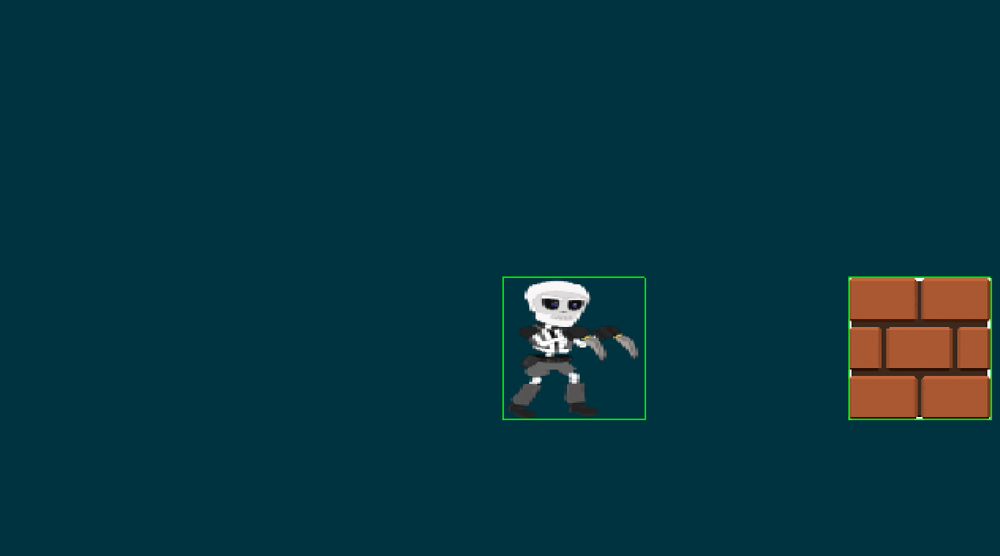
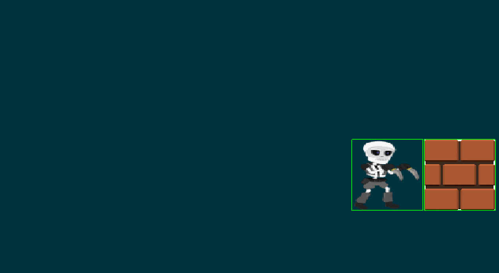

# Ejemplo de uso de Colisiones y LibGDX en Android.

Box2D es una biblioteca de física 2D. Es una de las bibliotecas de física más populares para juegos 2D y se ha portado a muchos idiomas y muchos motores diferentes, incluido libgdx.
La implementación de Box2D en libgdx es una delgada envoltura de Java alrededor del motor C ++. Por lo tanto, el excelente manual oficial de Box2D (PDF) también puede ser útil.

Fixture Representan la forma.
Los cuerpos (Body) representan entidades (velocidad, posicion pero carecen de forma) vienen en tres tipos diferentes: dinámico, cinemático y estático. Cada tipo se describe a continuación

Cuerpos dinámicos:
    Los cuerpos dinámicos son objetos que se mueven y se ven afectados por fuerzas y otros objetos dinámicos, cinemáticos y estáticos.

Cuerpos Estáticos:
    Los cuerpos estáticos son objetos que no se mueven y no se ven afectados por las fuerzas.

Cuerpos cinemáticos:
    Los cuerpos cinemáticos están algo entre cuerpos estáticos y dinámicos. Al igual que los cuerpos estáticos, no reaccionan a las fuerzas, pero al igual que los cuerpos dinámicos, tienen la capacidad de moverse.

En la imagenes siguientes se muestra el ejemplo corriendo en android:

